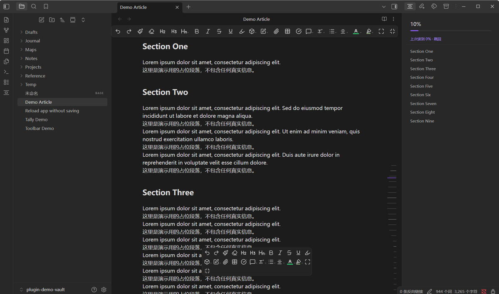

# Reading Rail Sidebar

> Track reading progress in the sidebar, with a heading outline, a density rail,
> and per-file resume positions.

Reading Rail Sidebar puts everything you need to know about *where you are* in a
long note into one panel on the right, and lets you get back to that spot later.

## What's in the panel

- **Progress** — percentage and a progress bar for the current note.
- **Current heading** — follows the section you are reading and shows
  `n / total` as you move through it.
- **Heading outline** — click any heading to jump to it. The panel follows along
  as you scroll.
- **Resume hint** — when you reopen a note you were partway through, it offers a
  one-click jump back to where you stopped.

## The rail

Along the right edge of the reading view there is a column of short ticks. It
replaces the native scrollbar (which the plugin hides) and carries more meaning
than one: each tick's **length** reflects how text-dense that part of the
document is.

Dense stretches — long paragraphs, tables, code — grow into peaks, mirroring the
heat-curve you'd see under a video player's progress bar. Sparse stretches stay
short. The curve is Gaussian-smoothed, so peaks rise and fall gradually instead
of stepping.

Tick **thickness** is uniform; only length varies. The tick you are currently
reading is highlighted.

**Interaction:** drag anywhere on the rail to scrub, or click a spot to jump
there. It behaves like the scrollbar you replaced. The rail works in edit view
too, following the same document.

## Why

Obsidian's built-in outline tells you the structure; the scrollbar tells you a
percentage. Neither tells you where the reading got dense — which is usually
exactly the part you were in the middle of, and exactly the part you can't find
again next session.

## How it works

The plugin uses only public Obsidian APIs — headings come from
`metadataCache.getFileCache()`, jumps go through
`view.currentMode.applyScroll()` — so it is not affected by updates to other
plugins or to Obsidian's internal DOM. Density is measured from the rendered
blocks at paint time and cached per file.

## Usage

Open the panel from the ribbon icon or the palette:

| Command | What it does |
|---|---|
| Open rail panel | Open the sidebar panel |
| Toggle rail panel | Open or close it |
| Jump to last position | Return to where you stopped in this note |

Settings cover the heading depth shown, whether to display the progress block,
and whether to remember reading position per file.

## Installation

**Community plugins:** search for "Reading Rail Sidebar" in Settings → Community
plugins.

**Manual:**

1. Download `main.js`, `manifest.json` and `styles.css` from the
   [latest release](https://github.com/yunmin311/reading-rail-sidebar-obsidian/releases).
2. Put them in `<vault>/.obsidian/plugins/reading-rail-sidebar/`.
3. Enable the plugin under Settings → Community plugins.

**Beta builds:** add `yunmin311/reading-rail-sidebar-obsidian` to
[BRAT](https://github.com/TfTHacker/obsidian42-brat).

## Language

The settings page, the panel itself, command names, the view title and every
notice are available in **Chinese and English**. Pick a language at the top of
the settings page: `Auto` follows Obsidian's own language, or pin it to
`简体中文` / `English` explicitly.

Adding another language is a pure data change — an extra entry in
`locales.js` — with no build step involved.

## Privacy

No network access. No telemetry. No accounts. Reading positions are stored
locally in the plugin's `data.json`, keyed by note path — they never leave your
machine.

## License

[MIT](LICENSE)

---

## 中文说明

把「阅读进度 + 标题导航 + 按文件记忆位置」做成右侧栏面板：进度百分比、当前标题跟随、
标题树点击跳转，以及下次打开时一键跳回上次读到的地方。

右侧那条刻度用**长度**反映正文的文本密度 —— 长段落、表格、代码这些密集处会鼓成峰，
像视频进度条底下的热度曲线；疏的地方保持短。曲线经高斯平滑，有起伏过渡而非突变。
刻度**粗细统一**，只有长度变化。可在刻度条上拖动或点击来定位。

安装：在社区插件里搜 "Reading Rail Sidebar"，或从 Release 下载三个文件放进
`.obsidian/plugins/reading-rail-sidebar/`。
